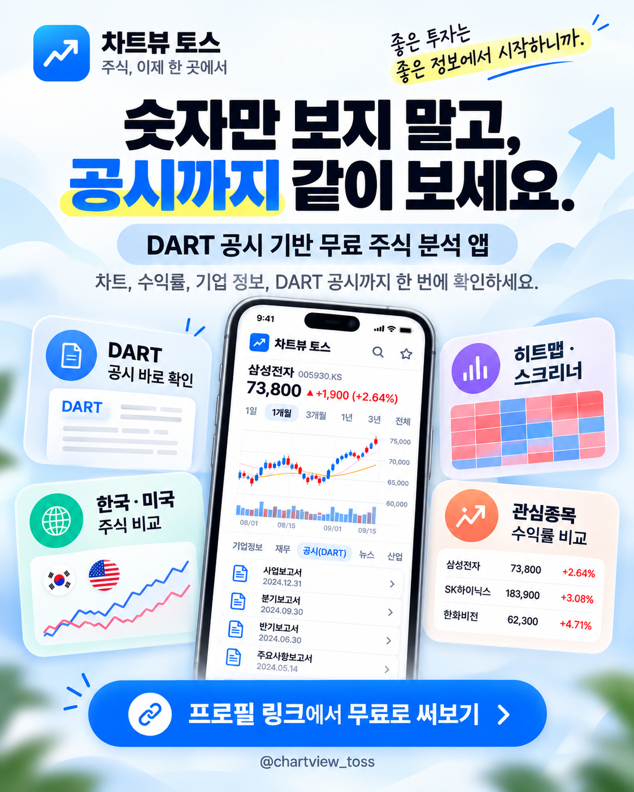

# Chart View for Apps in Toss

**새 PC에서 Codex 작업을 이어갈 때:** [현재 구조·UI 선호·실행·배포 인수인계](docs/CODEX_HANDOFF.md)를 먼저 읽으세요. 대화 기록 없이 최신 `main`에서 시작할 수 있습니다. 다른 Codex로 GitHub 도구·skill을 옮길 때는 [이관 및 설치 안내](docs/CODEX_TRANSFER.md)를 따르세요.



**숫자만 보지 말고, 공시까지 같이 보세요.**  
DART 공시 기반 기업 정보, 한국·미국 주식 비교, 히트맵, 스크리너, 밸류에이션을 한곳에서 확인할 수 있는 무료 주식 분석 앱입니다.

- 서비스: https://chart-view-toss.onrender.com
- 홍보/공유용 자산: [docs/marketing/README.md](docs/marketing/README.md)

Chart View의 앱인토스 전용 클라이언트 프로젝트입니다.

- 기존 웹 UI: `shoon94parkk-del/chart_View` (웹 UI 유지, Toss에 필요한 공용 API 계약은 additive 방식으로 확장)
- 이 저장소: 토스 미니앱 UI/앱 셸 및 연동 전용
- 원칙: 기존 Chart View API 계약을 재사용하고 앱인토스 전용 변경은 이 저장소에서 격리

## 개발 전 필수 문서

반복 개선 내용을 잃지 않도록 코드 변경 전 `AGENTS.md`, `docs/project-memory.md`, `docs/regression-guardrails.md`, `docs/decision-log.md`를 먼저 확인합니다. 행동 변경은 회귀 테스트와 결정 로그를 함께 갱신합니다.

## Live preview

- Render: https://chart-view-toss.onrender.com
- Backend API: https://chart-view-pkv8.onrender.com

## Current status

v0.8 release-plan implementation:
- Toss-style mobile information hierarchy and bottom navigation
- safe-area support
- home / chart / watchlist / more screens
- stock search with suggestions
- up to 6 selected tickers
- real Lightweight Charts rendering from the existing Chart View API
- period switching
- device-local watchlist and selected tickers
- loading / empty / retry states
- live market cards with Korean-friendly labels
- valuation comparison screen (FWD PER, PER, PBR, ROE, margin, dividend yield)
- macro indicators screen with market-environment summary
- stock detail screen with 3-month chart, valuation metrics, watchlist actions, and related news
- discovery screen using screener score / volume / trend signals
- personalized watchlist-news screen
- in-app hash/history navigation with back behavior
- Apps in Toss WebView SDK 3.5.0 pinned
- `apps-in-toss.config.ts` for `chartview` with native navigation bar enabled
- native back-event bridge on sub-pages while preserving the platform root-exit behavior
- native SDK `openURL(url)` for external/news/policy links with browser fallback
- best-effort native haptic feedback with browser-safe fallback
- Apps in Toss runtime hides the duplicate custom top bar and defers to the native navigation bar
- `/chart`, `/valuation`, `/macro`, `/discover`, `/news`, `/watch`, `/stock/:symbol` entry-route support for future major-feature deep links
- AIT contract checks run before every Render web build
- secondary-screen visual refresh: chart comparison, valuation, macro, and watchlist now share the richer home visual language
- valuation overview cards summarize selected-stock FWD PER / ROE / dividend-yield comparisons
- chart comparison shows a selected-period leader/range summary
- macro indicators use visual tiles and a market-environment hero card
- watchlist cards include price and quick valuation context
- P0 release hardening: API timeout/retry/offline handling
- global data-use disclosure and in-app data/service guide
- privacy, service-use, and data-methodology static pages
- Node 24 runtime pinning for Apps in Toss compatibility
- common stock selector sheet shared by chart / valuation / watchlist
- data-first Home order: market → daily TOP3 → daily heatmap → watchlist → summary → tools/news
- chart result table and explicit local-currency / adjusted-close / no-interpolation calculation basis
- watchlist add/edit/sort and undo delete
- valuation metric-first cross-company comparison
- macro unit / observation / change-basis / source presentation
- news direct-vs-industry relation, reason, language, and major/latest sorting
- stock detail separates day change from selectable-period return

## Architecture

The Toss client is deployed as a Render Static Site and reuses the existing Chart View FastAPI backend. The production web repository is kept isolated from Toss-specific UI changes.

## Apps in Toss build

The Render preview still uses `npm run build`. For the actual mini-app bundle:

```bash
npm install
npm run build:ait
```

The 3.x configuration lives in `apps-in-toss.config.ts`. The current app key is `chartview`.

## P0 release gates

Completed in code:
- Render preview alias is automatically synchronized to `main`
- API timeout/retry/offline handling
- data-use disclosure and policy pages
- Node 24 runtime pinning
- AIT contract validation and bundle pipeline

Operational gates still required before public release:
- confirm the remaining policy/data-provider conditions in `docs/P0_RELEASE_GATE.md`
- remove unacceptable cold-start dependency through a validated free path or authorized non-sleeping service
- run Android and iOS Sandbox/QR validation on real devices

## Next

- build a fresh `.ait` release candidate
- run Sandbox / QR validation on Android and iOS

## 2026-09-21 앱인토스 재등록

반려 대응, 검증 결과, 남은 기기·정책 확인은 docs/REVIEW_FIXES_20260921.md를 참고하세요.

## 2026-09-27 외부 링크 반려 대응

- Apps in Toss 외부 링크는 `Device.openURL`이 아니라 SDK top-level `openURL(url)`을 사용한다.
- 개인정보/서비스 이용/데이터 기준 안내는 `.ait` 런타임 origin에 의존하지 않고 `https://chart-view-toss.onrender.com`의 고정 HTTPS 페이지를 연다.
- 외부 링크 열기 실패는 조용히 무시하지 않고 사용자에게 재시도 안내를 표시한다.

## 배포 전 자동 E2E QA

OpenAI API 키 없이 Playwright가 PR과 main push를 검사합니다. 홈·검색·관심·상세·수출/DRAM·산업 탭·선정 성과·이동·장애 대응과 axe 접근성·키보드·메모리 가격 정합성을 데스크톱, Android, 320px, iPhone WebKit에서 검증합니다. 현재 범위와 실행 결과는 [자동 QA](docs/AUTOMATED_QA.md), [Codex 이관·전체 점검](docs/CODEX_TRANSFER_AUDIT_2026-10-08.md)에 기록합니다. 모든 핵심 QA가 통과한 정확한 main 커밋만 기존 Render 브랜치로 동기화합니다.

```bash
npm ci
npx playwright install --with-deps chromium webkit
npm run qa:prepush
```

선정 기록·수출 독립 로딩, 실패 복구, 조건 UX와 성능 측정 방법은 [개선 기록](docs/UX_LOADING_IMPROVEMENTS_20261008.md)에 정리했습니다.

실행/실패 screenshot·trace·HTML report/새 테스트 추가/실 API 검사/남은 실기기 gate는 [자동 QA 안내](docs/AUTOMATED_QA.md)를 참고하세요.

클라우드 Codex에서 브라우저 탐색·모바일 성능·코드 영향·데이터 경계값을 진단하는 선택 도구는 [클라우드 Codex 도구 안내](docs/CLOUD_CODEX_TOOLS.md)를 참고하세요. `npm ci --prefix tools/codex --ignore-scripts`로 별도 설치하며 앱 번들과 필수 CI 의존성은 유지합니다.

전문 개발·데이터 QA·모바일 QA·독립 검토와 검증된 장기 기록은 [Codex 에이전트 협업](docs/AGENT_WORKFLOW.md)을 참고하세요. agency-agents에서 선별한 역할과 기존 Playwright/프로젝트 기억을 연결하며 e2e·claude-mem의 실제 Codex 지원 및 추가 연결 조건도 기록합니다.
