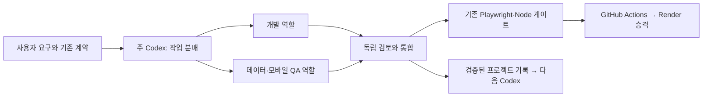

# 전문 Codex 에이전트 + 브라우저 QA + 장기 맥락

2026-10-07 사용자가 agency-agents + e2e + claude-mem을 여러 웹 프로젝트의 Codex 품질에 활용하자고 제안했다. 실제 GitHub 소스를 내려받아 두 Codex 하위 에이전트가 e2e와 claude-mem을 독립 조사하고 주 에이전트가 agency 역할/변환 코드를 검토했다. 이번 변경은 개발 협업 지침이다. 앱 코드·패키지·GitHub QA·Render 설정을 변경하지 않는다.

## 조사 결과

| 프로젝트 / 조회 시점 스타 | 확인한 source / 라이선스 | 실제 활용 경로와 조건 |
| --- | --- | --- |
| [agency-agents](https://github.com/msitarzewski/agency-agents), 약 15.8만 | `5baafd5f1452e9785c413065b033ec083ab27757`, MIT | 전문 역할 prompt 모음. Codex TOML 변환/CLI 설치를 지원하지만 파일 자체가 모델/오케스트레이터/장기 기억 엔진은 아님. 필요한 역할만 프로젝트에 맞게 채택 |
| [tester-army/e2e](https://github.com/tester-army/e2e), 약 6.8천 | 조사 main `59113aa4c8631894464088cf5ded187548578445`, stable `e2e@0.18.0` tag `b2a28d4813df9e0c0816cfffbdb51f4cc4e04faa`, Apache-2.0 | no-model MCP는 observe/tap/locate/screenshot/세션별 탐색 가능. AI act/assert/explore는 별도 모델이 필요. strict replay도 모든 모델 호출을 제거하는 CI 보장이 아님 |
| [claude-mem](https://github.com/thedotmack/claude-mem), 약 9.7만 | `71ddd11735d6dc38a6356fe376921fc216f2aa38`, v13.34.2, Apache-2.0 | 현재 Codex 지원. ChatGPT 로그인+Codex CLI provider로 API 키 없이 요약 가능하지만 별도 모델 실행이 구독 quota를 사용. hooks/플러그인/worker·영속 저장소와 실제 연결 검증 필요 |

소스는 `/workspace/scratch/chartview-agent-research/`에 다운로드했다. upstream 설치 스크립트·LLM 모델·worker·hook은 실행하지 않았다. 각 소스의 README와 구현·테스트를 읽었다. 이동하는 main 대신 위 SHA를 조사 기준으로 기록한다.

e2e 근거: `docs/reference/mcp.mdx`, `packages/e2e/tests/unit/mcp-tools-without-ai.test.ts`, telemetry 코드 및 cache/agent 구현. claude-mem 근거: `docs/codex-provider.md`, `README.md`, `src/services/integrations/CodexCliInstaller.ts`와 settings/capture/project identity 구현. agency 근거: README, 역할 파일, `scripts/convert.sh`의 `convert_codex`, `scripts/install.sh`의 `install_codex`.

## 지금 적용한 구조

[역할 프로필](agents/ROLES.md): coordinator, frontend, data-qa, mobile-qa, reviewer, recorder. 현재 Codex의 하위 에이전트 기능으로 역할·파일 소유권·프로젝트/SHA·완료 조건을 전달한다. 간단한 수정은 주 에이전트가 처리하고 독립 작업이 있을 때 필요한 2~3개 역할을 사용한다. 개발/QA가 같은 파일과 공용 report를 동시에 덮지 않도록 조정한다. 검토 담당자는 기본 읽기 전용이다.

멀티 에이전트의 효과는 이름/수보다 독립 검토와 구체적인 증거에 달려 있다. 기존 사용자 범위를 넘어 공유 backend, 유료 인프라, 공급자 데이터 또는 외부 메시지를 바꾸는 권한을 역할 이름으로 추가하지 않는다. 작업 후 기존 [자동 QA](AUTOMATED_QA.md)와 [클라우드 도구](CLOUD_CODEX_TOOLS.md)를 사용한다. 실행 중 성능 비교는 CPU·브라우저·데이터 조건을 맞춘다.

장기 기록은 현재 검증된 `project-memory.md`, `decision-log.md`, `CODEX_HANDOFF.md`와 QA 문서를 유지하며 [인수인계 양식](agents/HANDOFF_TEMPLATE.md)으로 project ID·SHA·검증·증거·미완료를 명시한다. 새 클라우드 머신에서 Git으로 다시 읽을 수 있다. 역할의 “기억한다”라는 prompt는 이 저장을 대체하지 않는다. 다른 프로젝트에는 역할/양식을 재사용하되 해당 프로젝트의 AGENTS와 테스트·저장소 식별자를 별도 지정한다. 미설치/미검증 상태를 숨겨 전역 자동 연결이나 모든 프로젝트의 로그 보존을 주장하지 않는다.

## e2e 추가 연결의 조건

이번에는 소스 조사만 수행했으며 e2e 런타임/MCP를 설치·연결하지 않았다. 현재 agent-browser/Playwright가 직접 탐색과 필수 회귀를 수행한다. e2e를 추가할 때는 no-model MCP만 별도 도구 패키지에 고정하고 실제 세션에서 도구 호출을 검증한다. npm 설치만으로 현재 ChatGPT의 MCP 도구 목록에 서버가 연결되지는 않는다. upstream init의 자동 등록 대상은 Claude Code·Cursor다.

- web engine의 Playwright Core 1.63.0은 현재 앱 QA 1.55.0과 분리한다.
- `E2E_TELEMETRY_DISABLED=1`을 사용하고 upstream skill의 외부 `feedback` 전송 권고를 가져오지 않는다.
- 자체 AI 명령이나 별도 OAuth/모델/provider 경로를 CI에 넣지 않는다. 세션별 탐색에서 발견한 문제를 기존 Playwright 회귀로 고정한다.
- Android native는 SDK/KVM/APK, iOS native는 macOS/Xcode가 필요하다. 모바일 web viewport는 Toss 실제 SDK/기기 검증이 아니다.

## claude-mem 자동 기록의 조건

이번에는 소스 조사만 수행했으며 claude-mem worker·플러그인·자동 수집을 설치하거나 활성화하지 않았다. 현재 CLI의 ChatGPT 로그인 상태만 확인했고 auth 파일이나 실제 worker 요청은 검사하지 않았다. 현재 ChatGPT cloud 대화와 Codex CLI 플러그인 hooks는 같은 연결이라는 보장이 없다.

추가 도입 시 별도 CLI 환경에서 `--provider codex`로 키 없는 경로를 명시해야 한다. 기본 hosted observer의 계정/trial 또는 Anthropic 경로를 무심코 켜지 않는다. 자동 연결은 Codex 플러그인 등록/전역 hooks 신뢰와 세션 재시작, Bun worker와 영속 SQLite를 필요로 한다. 선택적 Chroma 없이 SQLite FTS로 검색할 수 있다.

기본 capture는 prompt/tool 입력·응답/마지막 응답을 수집하며 redaction 기본 OFF, telemetry 기본 ON이다. 실제 사용 전 마스킹·telemetry OFF·비밀/개인 데이터 제외·보존 범위를 설정한다. 프로젝트 기본 식별은 이름 기반이므로 여러 저장소는 remote 기반 식별 또는 독립 data directory로 분리한다. cloud scratch SQLite는 새 머신으로 자동 이어지지 않는다. 하위 에이전트 transcript 수집은 기본 OFF이며 이를 켜는 요약 요청도 quota를 사용한다. 자동 요약은 가설을 확정 사실로 만드는 권한이 아니다.

## 비용과 검증 범위

이번 적용에 새 OpenAI/외부 LLM API·키·자동 원문 수집·서비스는 없다. 현재 Codex 하위 에이전트도 기존 Codex 이용량을 쓰며, 여러 agent와 claude-mem의 Codex 요약을 무료 무제한으로 해석하지 않는다. CI는 기존 결정론적인 Playwright를 유지한다.

현재 확인한 것은 두 하위 에이전트의 독립 소스 조사, 역할별 근거·제약 보고, 프로젝트 역할/인수인계 지침이다. e2e MCP 연결, claude-mem 자동 저장/검색/재시작 후 기억 재주입은 검증하지 않았다. 실제 기능 변경 시 개발→브라우저 QA→필수 회귀→CI→배포→검증된 기록 순서로 사용한다.
